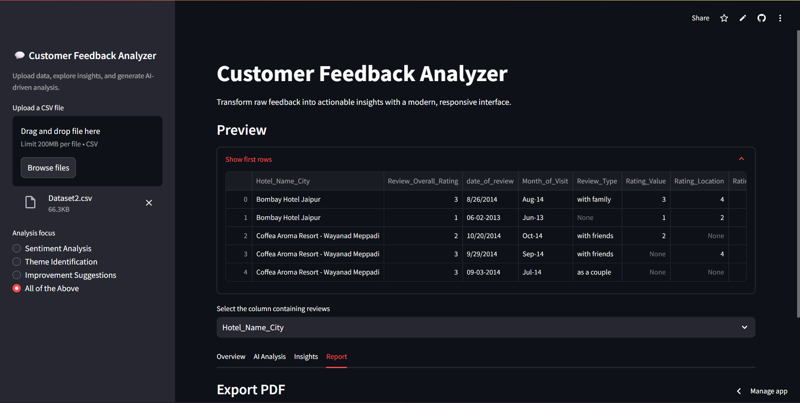

# SentAi — Intelligent Customer Feedback Analysis

Made by **Priyanshi Sharma (GLA University)**  •  GitHub: [`Priyanshi250/SentAi`](https://github.com/Priyanshi250/SentAi) •  Streamlit: [`Streamlit/SentAi`](https://sentai.streamlit.app/)

SentAi is a modern Streamlit app that transforms raw customer feedback into actionable insights. Upload a CSV, pick your review column, and get AI‑generated sentiment, themes, and improvement suggestions—plus quick visual summaries and a downloadable PDF report.



## ✨ Features
- **CSV upload**: Bring your own feedback data.
- **Focus selection**: Sentiment, Theme Identification, Improvement Suggestions, or All.
- **AI insights (Gemini)**: Structured Markdown results with clear headings and lists.
- **Overview metrics**: Rows, non-empty rows, average words per review.
- **Sentiment chart (VADER)**: Fast Positive/Neutral/Negative distribution.
- **Top words chart**: Quick frequency view (lightweight, no heavy preprocessing).
- **PDF export**: One‑click downloadable insights report.
- **Distinct dark theme**: Clean, professional UI optimized for Streamlit Cloud.

## 🗂️ Project structure
```
Customer-feedback/
  ├─ main.py                 # Streamlit app (entrypoint)
  ├─ analysis.py             # Gemini prompt + analysis
  ├─ requirements.txt        # Dependencies for Streamlit Cloud
  ├─ Dataset1.csv            # Sample data
  └─ Dataset2.csv            # Sample data
```

## 🚀 Quickstart (local)
From the `Customer-feedback` folder:
```bash
pip install -r requirements.txt
streamlit run main.py
```

Open the app, upload a CSV, choose the text column, pick an analysis focus, and run.

## ☁️ Deploy on Streamlit Cloud
1. Push this repository to GitHub (already at `Priyanshi250/SentAi`).
2. Create a new app on Streamlit Cloud and set the app file to `Customer-feedback/main.py`.
3. Add a secret for your Gemini key:
   - Go to App → Settings → Secrets and add:
     ```
     GEMINI_API_KEY=your_api_key_here
     ```
4. Deploy. That’s it.

## 🔐 Environment variable
- `GEMINI_API_KEY`: Create one in Google AI Studio (`https://aistudio.google.com/app/apikey`).

## 🧰 Tech stack
- Streamlit UI with a wide layout, tabs, and sidebar
- Google Gemini for AI analysis
- VADER (lightweight) for quick sentiment distribution
- Plotly for charts, ReportLab for PDF export

## 🧪 Usage tips
- If the CSV is large, start with a smaller sample to preview.
- Ensure you select the correct column containing textual feedback.
- If AI analysis says the key is missing, add `GEMINI_API_KEY` in secrets.

## 📄 License
This project is for academic use. You may adapt it with attribution to the author.

## 👤 Author
Made by **Priyanshi Sharma**, GLA University.
GitHub: [`Priyanshi250/SentAi`](https://github.com/Priyanshi250/SentAi)
